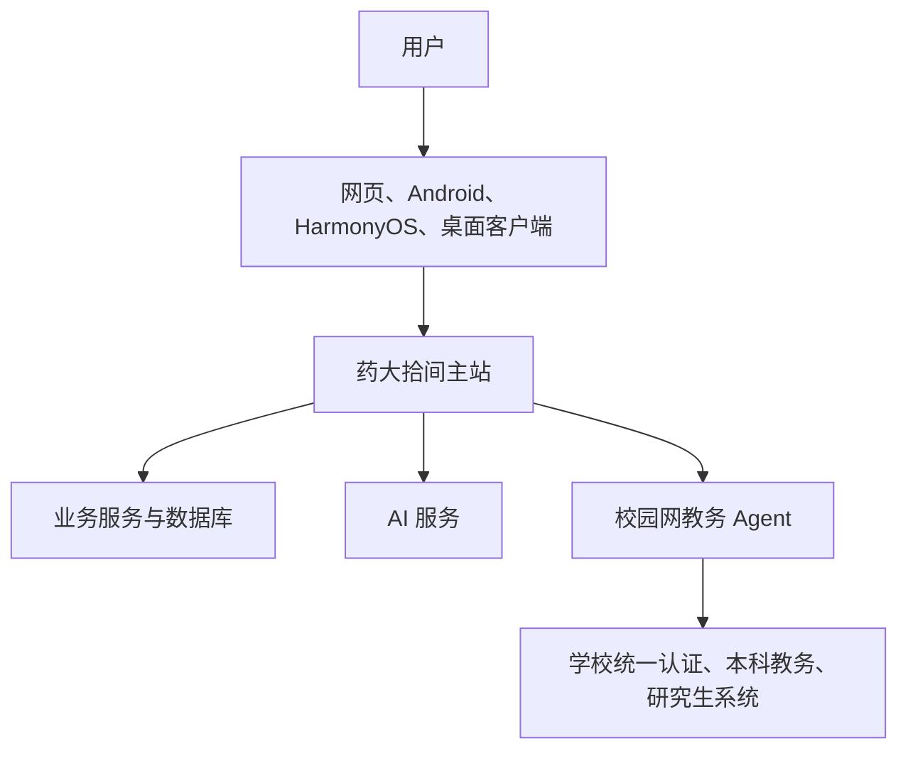

# 药大拾间是怎么工作的？

这是一份写给普通用户、学生开发者和所有对项目感兴趣的人的说明。它不要求你会编程，也不会把一大串框架名称当成“技术路线”。

如果只用一句话概括：

> 药大拾间把分散在学校网站、校园服务和不同设备上的常用功能，整理到一个统一入口；能由网页完成的就放在主站，需要校园网或系统能力的部分，则交给校园网 Agent 和桌面、移动客户端完成。

本项目由学生开发和维护，**不是中国药科大学官方平台**。

## 一张图看懂整体结构



可以把它理解成一家校园服务“总台”：

- **主站**负责接待用户、展示页面、保存站内内容和安排任务；
- **数据库**保存账号、论坛、通知、文件收集、订单等站内数据；
- **校园网 Agent**像一名待在校园网里的联络员，代主站访问只能从校内正常打开的教务页面；
- **桌面与移动客户端**是在网页外面补上自动联网、小组件、学习通窗口等系统能力；
- **AI 服务**负责站内问答、学习通题目辅助和内容安全，但三者互相独立。

## 从打开页面到看到内容，发生了什么？

### 1. 普通站内功能

首页、公告、论坛、校园服务、失物招领、文件收集和药苑之声等功能，走的是常见的网站流程：

1. 用户打开网页或客户端；
2. 页面向药大拾间服务器请求内容；
3. 服务器检查访问权限，并从数据库或公开信息源取回数据；
4. 页面把结果整理成适合电脑和手机阅读的样子。

论坛帖子、个人资料、文件提交、赞助记录等属于药大拾间自己的数据。公开公告则会从学校公开网页同步，并标明来源。

### 2. 学校统一认证和教务数据

课表、成绩等信息不在药大拾间自己的数据库里。读取这类信息时，大致会经历：

1. 用户主动进入教务页面并发起登录；
2. 药大拾间显示学校统一认证所需的验证码；
3. 学校统一认证验证账号；
4. 系统判断当前账号应进入本科教务还是研究生系统；
5. 校园网 Agent 使用学校签发的会话访问对应页面；
6. 药大拾间把学校页面里的课表、成绩等内容整理成统一格式，再交给用户查看。

目前本科教务主要支持课表、正式成绩、期中成绩、考试安排、校历、学业完成情况和培养方案；研究生入口当前主要支持课表。页面只会展示实际读取到的数据，不会凭空补全学校没有返回的内容。

这些是对学校现有网页流程的适配，并不是学校为第三方专门提供的公开 API。因此学校改版、登录规则变化或校园网络调整时，解析也需要跟着维护。

### 3. 为什么还需要校园网 Agent？

有些学校系统只能在校园网环境中稳定访问，公网服务器即使知道地址也不一定能打开。

我们的做法不是把主服务器搬进校园，而是在校园网内运行一个很小的 Agent：

- Agent 主动向药大拾间服务器建立连接，不需要在校园网电脑上开放公网入口；
- 主站只能让它执行预先允许的教务操作，不能随意把它当成代理服务器；
- 多个 Agent 可以同时在线，系统会选择可用节点，并在节点掉线时切换；
- 会话在传递和暂存时会加密，Agent 身份也会被固定和校验；
- Agent 可以独立更新，不需要每次更新整个网站。

这样既解决了网络位置问题，也把校园网访问能力限制在明确的范围内。

## 各个客户端分别做什么？

| 入口 | 主要用途 | 为什么存在 |
|---|---|---|
| Web 主站 | 几乎全部校园服务与社区功能 | 打开浏览器即可使用，更新最快 |
| Android 客户端 | 移动端主站、课表和桌面小组件 | 补充系统小组件、文件和通知等能力 |
| Flutter 客户端 | 新一代移动客户端外壳 | 统一后续 Android 等移动端开发路线 |
| HarmonyOS 客户端 | HarmonyOS Web 容器与系统桥接 | 适配鸿蒙设备的文件、图片和外链能力 |
| Windows / macOS 客户端 | 主站、校园网自动连接、学习通助手 | 提供浏览器无法可靠完成的本机网络和受控脚本能力 |

这些客户端不是各写一套完全不同的校园平台。大部分界面和业务规则仍来自同一个主站，因此网站修复后，各端通常也会一起生效。

桌面客户端额外负责：

- 判断电脑是否真的处在校园网环境中；
- 在断网且检测到校园网网关时尝试自动认证；
- 网络恢复、切换 Wi-Fi 或电脑唤醒后重新检查；
- 用系统安全存储保存用户明确要求记住的校园网或学习通凭据；
- 在独立受控窗口中运行学习通助手；
- 提供托盘、开机启动、手动检查更新等桌面能力。

课表页保留了移动端离线缓存和“添加到主屏幕”能力，但它只是课表的便捷入口，不用来冒充 Windows 或 macOS 桌面客户端。

## AI 分成三条独立路线

### 拾间 AI

拾间 AI 用来回答站内功能、校园服务以及一般学习生活问题。它会使用整理后的公开知识和站点说明，但**不会读取或代查用户的课表、成绩、考试、学业进度、账号额度和站内消息**。涉及本人数据时，它会引导用户进入对应页面自行查看。

对话按每日免费额度和 AI 点数计费，具体规则由服务器统一下发，客户端不会把数字写死。

### 药大拾间·学习通助手

学习通助手运行在桌面客户端的独立学习通窗口中。需要 AI 解题时，只提交当前题目所需的文字、选项和图片，不附带药大拾间数据库、个人教务数据或整份站内知识库。

助手脚本可以从药大拾间服务器检查更新。普通逻辑和文案调整不必重新下载安装包；如果更新需要新增可访问网站、联网域名或更高权限，仍必须发布新的客户端版本。

使用限制也由服务器控制。目前可以临时切换为“安装即可使用、免账号额度”，之后恢复账号限制时同样不需要强制用户更新客户端。即使处于不限业务额度模式，服务器仍会保留异常请求限流，避免程序错误造成大量重复请求。

### 内容安全

论坛、图片等公开内容使用单独的审核流程。它和拾间 AI 的聊天模型、学习通解题模型不是同一个开关，也不会因为聊天模型变化而自动改变社区审核标准。

AI 只能提供辅助结果，不能替代学校通知、教务页面、教师判断或人工审核。

## 数据怎么保存？

药大拾间会把数据分成两类处理。

### 站内数据

账号资料、论坛内容、通知、文件收集记录、商城订单、赞助记录和后台配置等，需要写入药大拾间自己的 PostgreSQL 数据库。部分缓存、限流和临时会话由 Redis 或兼容缓存承担。

药苑之声作为独立子系统运行，有自己的服务和数据库，但登录身份与药大拾间打通，用户不需要再注册一遍。

### 学校数据与凭据

- 学校密码和验证码不会写入药大拾间数据库或日志；
- 教务会话只在用户授权后建立，并以加密形式暂存；
- 用户退出或撤销授权后，对应会话会被清理；
- 桌面端“记住密码”使用操作系统安全存储，关闭功能或手动清除后即删除；
- 站内登录会话与学校教务会话是两套东西，站内已登录不等于教务一直有效。

项目仍然需要遵守个人信息保护、内容管理、支付和部署所在地的相关要求。开源代码本身不能替代实际运营中的授权、备案、制度和人工管理。

## 更新与部署怎么进行？

主站运行在 Linux 服务器上，主要由四部分组成：

- 对外提供网页和接口的主服务；
- PostgreSQL 数据库；
- Redis 或兼容缓存；
- 独立运行的药苑之声服务。

代码更新后，部署脚本会判断改动属于主站、药苑之声还是数据库，只构建和重启受影响的部分。校园网 Agent 在校园网电脑上单独部署和更新，不会跟着公网服务器一起重启。

不同更新的生效方式也不同：

| 改动 | 用户如何获得 |
|---|---|
| 网页、服务端、站内知识和大多数业务规则 | 服务器部署后直接生效 |
| 学习通助手普通脚本更新 | 客户端自动或手动检查云端脚本 |
| 桌面端本机能力、权限边界、Electron 代码 | 发布新的 Windows / macOS 安装包 |
| Android、Flutter、HarmonyOS 原生能力 | 发布对应平台新版本 |

正式客户端产物通过 GitHub Release 发布，也可以同步到国内网盘等下载入口。

## 我们为什么选择这条路线？

几个核心原则一直没有变：

1. **能复用网页就不重复造一套。** 多端共享业务和界面，能减少不同设备功能不一致的问题。
2. **需要本机权限的功能才进客户端。** 自动联网、托盘、小组件和学习通脚本不能只靠普通网页可靠完成。
3. **校园网访问单独隔离。** 公网主站不伪装成校园网，专门的 Agent 只做允许的教务任务。
4. **权限变化不能悄悄下发。** 普通脚本可以云端更新，新增域名或权限必须重新发布客户端。
5. **AI 不假装拥有用户数据。** 读不到就明确说明，不能编造成绩、课表或考试安排。
6. **学校系统变化是正常维护成本。** 我们适配的是现有网页流程，学校改版后需要重新测试和解析。

## 用到了哪些技术？

不需要记住这些名称；它们只是实现上述分工的工具。

| 部分 | 主要技术 | 通俗解释 |
|---|---|---|
| 主站页面 | Vue 3、TypeScript、Vite | 负责用户看到和操作的网页 |
| 主服务 | Node.js、Express、TypeScript | 处理登录、权限、业务和客户端请求 |
| 数据 | PostgreSQL、Prisma、Redis | 保存长期数据，并处理临时缓存 |
| 桌面端 | Electron | 把网页能力与 Windows、macOS 系统能力接起来 |
| Android | Android WebView / Flutter | 承载移动网页并提供系统桥接和小组件 |
| HarmonyOS | ArkUI Web | 在鸿蒙设备中承载站点并调用系统能力 |
| 药苑之声 | Nuxt、Nitro、Drizzle | 独立的点歌、排期和广播站管理系统 |
| 校园网 Agent | WebSocket、加密会话 | 让校园网内的小程序安全接收有限任务 |

仓库中的主要目录也按这套分工排列：

```text
web/            主站前端
server/         主站后端与校园网 Agent
desktop/        Windows / macOS 桌面客户端
android/        Android WebView 客户端
flutter_client/ 新一代 Flutter 移动客户端
harmony/        HarmonyOS 客户端
voicehub/       药苑之声
runtime/        部署运行时辅助文件
```

## 当前边界和已知限制

- 项目不是学校官方产品，也不代表学校立场；
- 研究生教务当前主要完成课表读取，本科功能更完整；
- 学校登录或页面结构改变后，相关功能可能暂时失效；
- 未签名或未公证的桌面安装包可能触发 Windows、macOS 的安全提示；
- 网页可以快速更新，但涉及客户端本机权限的改动必须重新打包；
- AI 可能出错，涉及成绩、考试、缴费和校方政策时应以学校页面和正式通知为准；
- 开源仓库不包含生产密钥、用户数据、学校标识授权和实际运营资质。

## 贡献与开源

- 学习通助手集成与桌面客户端初版由 **Mom0ka27** 贡献开发；
- 校园网连接模块基于真红（SoraNoNeko）的 `cpu_net` 项目修改；
- 内置学习通辅助脚本基于 shushoujiu 的满分助手修改并获授权；
- 主项目由药大拾间持续维护，并接受问题反馈和代码贡献。

本仓库的代码开源方向为 `AGPL-3.0-or-later`；品牌、Logo、域名、密钥、生产数据、用户数据和第三方素材不随代码授权。正式使用时应以仓库许可文件和第三方声明为准。

如果你想参与，不一定非要会写后端。你也可以：

- 帮忙测试不同设备和网络环境；
- 反馈学校页面改版后的真实情况；
- 改进文案、教程、无障碍和移动端体验；
- 补充合法、可靠、可核验的校园知识；
- 检查隐私、安全和权限边界；
- 提交 Issue、代码修复或功能建议。

项目仓库：[github.com/sx120609/CPU-web](https://github.com/sx120609/CPU-web)

