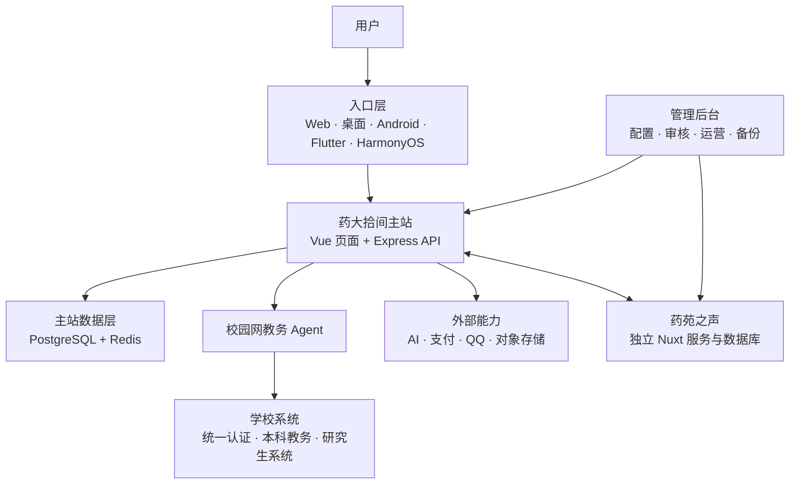
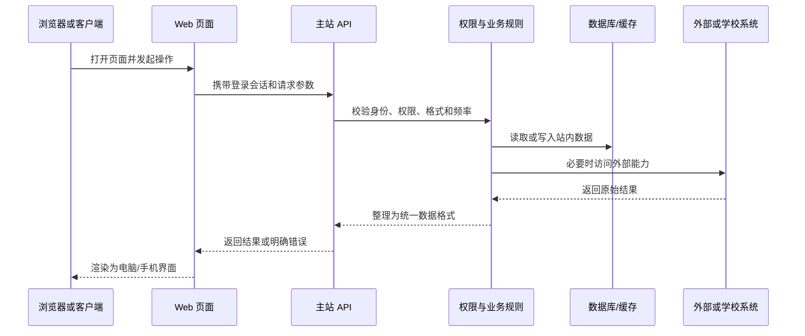
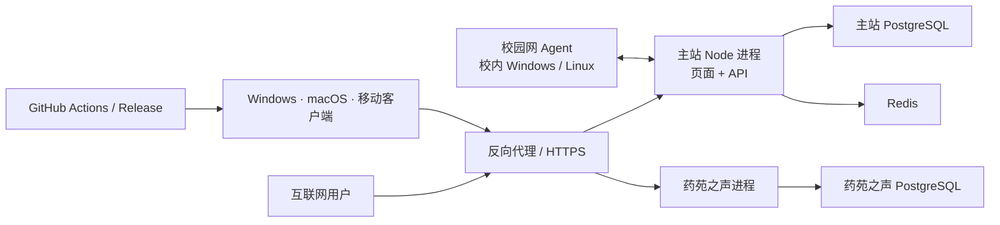

# 药大拾间完整技术路线

> 面向普通用户、学生开发者和项目贡献者的全站说明
> 文档基于 2026 年 7 月 30 日仓库实现整理

药大拾间不是一个只有论坛或课表的单页网站，而是一套由主站、教务适配层、校园网 Agent、桌面与移动客户端、广播站子系统、消息机器人和管理后台共同组成的校园服务平台。

这份文档不要求读者会编程。它重点回答：

- 用户从一个入口点下去后，请求到底经过了哪些环节；
- 哪些数据属于药大拾间，哪些只是临时从学校系统读取；
- Web、Windows、macOS、Android、HarmonyOS 分别承担什么工作；
- 论坛、教务、二手交流、文件收集、拾间 AI、药苑之声等模块如何协作；
- 系统如何部署、更新、降级，以及隐私和权限边界在哪里。

> **项目身份说明：**药大拾间由学生开发和维护，不是中国药科大学官方平台，也不代表学校立场。涉及成绩、考试、缴费和校方政策时，应以学校系统和正式通知为准。

---

## 1. 先用一张图看懂全站



可以把它理解成一个校园服务“总台”：

1. **入口层**负责适配电脑、手机和不同操作系统。
2. **主站**负责登录、权限、页面、业务规则和对外 API。
3. **主站数据层**保存论坛、服务、订单、通知等站内数据。
4. **校园网 Agent**代表主站在允许的范围内访问校内教务页面。
5. **学校系统**仍然是课表、成绩等教务数据的原始来源。
6. **外部能力**提供 AI、支付、QQ 消息和远程文件存储。
7. **药苑之声**是独立运行、但与主站身份和通知打通的子系统。
8. **管理后台**控制模块开关、内容审核、工具配置和运行维护。

---

## 2. 用户请求的共同路径

大部分功能虽然页面不同，但都遵循一条共同路线：



主站不会让页面直接连接数据库，也不会把支付密钥、AI 密钥或学校会话交给浏览器。页面只描述“想做什么”，服务端判断“能不能做、由谁做、需要哪些数据”，再返回结果。

当某项功能不需要外部系统时，请求只经过主站和数据库；需要教务、支付、AI 或 QQ 时，才会进入相应的专用链路。

---

## 3. 账号、登录和权限

### 3.1 两套身份不要混淆

药大拾间同时存在两类身份：

| 身份 | 用途 | 是否等同 |
|---|---|---|
| 药大拾间站内账号 | 论坛、通知、二手交流、AI 额度、工具权限和个性化设置 | 否 |
| 学校统一认证 / 教务会话 | 读取本人课表、成绩、培养方案等教务信息 | 否 |

用户在主站已登录，不代表教务会话永远有效；教务会话失效后，可以只重新连接学校系统，不必退出主站。

### 3.2 站内登录

主站支持站内账号，也可以通过学校统一身份认证建立或关联站内身份。登录成功后：

- 浏览器获得受保护的会话；
- 服务端识别用户、角色和模块权限；
- 重要写操作还会通过 CSRF 等机制确认请求确实来自当前页面；
- 兼容客户端或授权场景时，可以使用受限的 Bearer Token / OAuth 令牌。

公开注册是否开放由实际运营策略决定，而不是由前端按钮单独决定。

### 3.3 权限不是只有“管理员”和“普通用户”

系统使用多层权限：

- 全局角色：普通用户、版主、管理员、机器人；
- 模块角色：药苑之声、失物招领等模块可有单独身份；
- 工具权限：问卷、成绩查询表、文件收集等可以委托给指定负责人；
- 功能开关：论坛、二手交流、评课、电费、赞助等可独立启停；
- 内容归属：作者、交易双方、认领双方只能操作与自己有关的数据；
- OAuth 范围：桌面端只获得被授权的 `openid`、`profile`、`ai` 等能力。

这意味着“能登录”不等于“能管理所有内容”，一个工具负责人也不会因此得到整个后台权限。

---

## 4. 首页、导航、搜索和服务入口

### 4.1 首页如何组成

首页不是一张写死的宣传页。它会综合：

- 全局置顶内容；
- 校园公告；
- 热议主题和最新内容；
- 校园服务入口；
- 当前账号和站点状态；
- 可用模块及运营配置。

顶栏导航和部分服务卡片可以在后台调整。管理员可以改变显示名称、顺序、链接、可见性和登录要求，而不必重新发布客户端。

### 4.2 搜索分成两类

- **普通搜索**：查找站内帖子、服务、公告等已有内容；
- **拾间 AI**：用自然语言回答站点使用方法和公开校园问题。

两者不能混为一谈。普通搜索返回数据库里真实存在的条目；AI 生成的是回答，并可能出错。

### 4.3 服务卡片

服务页既包含主站自建工具，也包含校内外链接。后台可以把一个外部“教务入口”规范化到主站教务页，避免用户在多个相似入口之间迷路。

---

## 5. 论坛与社区内容

### 5.1 从发帖到展示

一条帖子通常经历：

1. 用户选择版块、标题、正文、标签和附件；
2. 页面先检查必填项和文件限制；
3. 服务端再次检查登录状态、发帖权限、频率和内容格式；
4. 文字、图片或视频进入对应审核流程；
5. 审核结果决定立即展示、等待人工复核或拒绝；
6. 帖子写入数据库并生成通知、热度等关联数据；
7. 其他用户在首页、版块、搜索或分享页看到它。

### 5.2 论坛能力

论坛支持：

- 普通帖、问答帖、公告、二手交流帖、评课等不同版块；
- Markdown 正文、标签、图片、视频；
- 回复、楼中楼、精简引用和点赞；
- 置顶、锁定、隐藏、删除及人工审核；
- 匿名发帖和匿名回复；
- 分享页与分享卡片；
- 回复、点赞和审核结果通知。

匿名并不表示数据库里完全没有身份关联。系统需要保留最小限度的内部关联，才能防滥用、处理举报和让同一讨论中的匿名标识保持一致；公开页面不会直接展示真实账号。

### 5.3 热度、信誉和社区治理

论坛会结合浏览、回复、点赞等信号形成热度。用户也可能拥有信誉或活跃度，用于社区展示和治理。冻结、限制、版主处理等动作由服务端执行，不能只靠前端隐藏按钮。

### 5.4 内容审核

文字、图片和视频使用相互配合的审核链路：

- 规则与格式校验先过滤明显异常；
- AI 审核给出辅助判断和原因；
- 边界内容可以进入人工复核；
- 作者可以在允许的情况下申请人工复核；
- 审核日志保留处理过程，便于管理员核对；
- 白名单是受控例外，不是关闭全站审核。

聊天 AI、学习通解题 AI 和公开内容审核使用独立配置，修改聊天模型不会自动改变论坛审核标准。

---

## 6. 校园公告与外部内容同步

### 6.1 学校公开公告

主站可以配置多个学校公开信息源。抓取器定期读取公开网页，将标题、发布时间、来源、摘要和链接整理成统一格式，再展示到公告或只读版块。

原文仍以来源网站为准。主站的作用是聚合和提高可读性，不会把同步结果伪装成本站原创。

## 7. 教务数据的完整链路

这是全站最容易被误解、也最依赖外部环境的部分。

### 7.1 学校侧涉及的入口

当前适配的学校页面包括：

- 学校统一身份认证；
- 本科旧版与新版教务入口；
- 研究生教务入口。

这些页面并不是学校为第三方开发者承诺长期稳定的公开 API。项目适配的是学校当前已有的登录流程、HTML 页面和部分数据请求。因此学校改版、验证码规则变化、域名调整或校园网策略变化时，解析需要同步维护。

### 7.2 登录与识别过程

用户主动进入教务页后，大致发生：

1. 服务端向学校统一认证请求登录上下文和验证码；
2. 用户输入学号、密码和验证码；
3. 凭据仅用于本次向学校认证，不写入主站数据库或普通日志；
4. 学校返回认证结果和会话；
5. 系统尝试可用教务入口，识别本科生或研究生；
6. 校园网 Agent 代表主站访问仅校内可达的页面；
7. 解析器将学校页面整理为统一结构；
8. 页面按实际取得的数据展示对应功能。

### 7.3 本科与研究生能力

当前本科适配范围较完整，主要包括：

- 课表；
- 正式成绩；
- 期中成绩；
- 考试安排；
- 校历；
- 学业完成情况；
- 培养方案；
- 部分教学应用入口。

研究生入口当前主要完成学期与课表读取。页面不应该为研究生凭空显示没有真实数据来源的成绩或考试安排。

### 7.4 为什么要校园网 Agent

部分学校系统从公网服务器无法稳定访问。项目没有把主站伪装成校园网，而是在校园网内运行一个职责受限的 Agent：

- Agent 主动向公网主站建立出站 WebSocket，不要求校园网机器开放公网端口；
- 主站只能下发预先列入白名单的教务动作；
- 多个 Agent 可以同时在线，主站选择可用节点并处理掉线；
- 同一用户的连续请求尽量保持在兼容节点上；
- 会话传递使用混合加密，Agent 身份会被登记和校验；
- Agent 可以独立升级，不必等待主站或客户端发版。

它不是通用代理，也不能被任意用来访问校园网里的其他地址。

### 7.5 学校页面如何变成可读数据

学校不同页面可能返回 HTML、表格、脚本变量或 JSON。适配层会：

1. 检查是否被重定向回登录页；
2. 识别当前系统和页面类型；
3. 提取课程、教师、时间、成绩等字段；
4. 统一学期、周次、星期和节次表达；
5. 去除只用于页面排版的内容；
6. 返回结构化结果；
7. 当字段缺失时保留“未知”或不展示，而不是猜测。

### 7.6 教务会话如何保存

- 学校密码和验证码不写入主站数据库或应用日志；
- 学校返回的会话与必要副本以加密形式保存；
- 会话按服务器策略过期，退出教务或撤销授权时会被清理；
- 站内会话与教务会话相互独立；
- 页面缓存只能帮助更快显示最近结果，不能替代有效教务会话。

---

## 8. 课表、课程和评课

### 8.1 课表页面

课表将学校原始结果转换成：

- 日视图和周视图；
- 学期、教学周和日期切换；
- 课程名称、教师、地点、节次和周次；
- 移动端友好的布局；
- 最近课表缓存和较快的首屏显示。

### 8.2 课表编辑

用户可以在站内：

- 新增自定义课程；
- 修改显示信息；
- 隐藏或恢复学校课程；
- 调整只影响自己的课表。

这些编辑作为用户的覆盖层单独保存，不会修改学校教务系统，也不会影响其他用户。

### 8.3 小组件与快捷入口

课表可以为 Android 小组件或其他只读小组件签发专用令牌。令牌只提供所需的有限课表数据，不等同于完整站内登录。

移动网页保留“添加到主屏幕”等便捷能力，但它只是课表快捷入口，不用于冒充 Windows 或 macOS 桌面客户端。

### 8.4 课程库与评课

课程库可以从用户已授权读取的成绩、培养方案等结果中逐步整理课程与教师关系。评课内容写入主站数据库，并经过登录、权限和内容审核。

课程目录是站内为了检索和关联形成的索引，不是对学校教务数据库的完整复制。

---

## 9. 校园服务与通用工具平台

服务中心不仅是一组链接，还提供一套可配置的工具框架。

### 9.1 工具的共同能力

每个工具可以配置：

- 是否展示；
- 是否要求登录；
- 是否允许公开提交；
- 谁可以管理；
- 是否发送 QQ 提醒；
- 表单、文件和结果如何保存。

当前通用工具类型包括反馈、问卷、成绩查询表、文件收集和 PDF 工具。

### 9.2 问卷

问卷支持：

- 单行、多行、数字、日期、评分；
- 单选和多选；
- 匿名或登录后填写；
- 单次或多次提交；
- 根据回答结束或跳转到指定问题；
- 结果统计与管理。

分支逻辑由服务端配置并由前端渲染，不能依赖用户手动跳过不相关题目。

### 9.3 成绩查询表

这是供活动负责人上传名单或结果的通用工具，不等同于学校教务成绩：

1. 管理员或受委托负责人上传列定义和数据行；
2. 每行通过学号等字段与当前登录用户匹配；
3. 普通用户只能看到自己的匹配结果；
4. 负责人可以查看整体状态和反馈；
5. 可配套创建反馈问卷和 QQ 提醒。

### 9.4 文件收集

文件收集覆盖从发起到打包的完整流程：

- 发起人创建任务、说明、截止时间和负责人；
- 配置动态信息字段、问卷字段和分支；
- 导入应交名单；
- 配置文件名、目录和重复提交规则；
- 用户填写信息并上传文件；
- 服务端创建直传会话或接收本地上传；
- 管理端查看已交、未交、异常和重复情况；
- 支持预览、下载、CSV 导出和 ZIP 打包；
- 对损坏映射或历史数据提供修复能力。

文件可以保存在本机磁盘，也可以通过配置的远程存储保存。

### 9.5 PDF 工具

PDF 合并、拆分、旋转、图片互转、文本提取和基础压缩尽量在浏览器本地完成。普通操作不需要把文件上传到服务器，降低隐私风险和服务器压力。

### 9.6 宿舍电费查询

页面接收用户输入的查询条件，由服务端访问对应查询来源并整理结果。主站只负责统一入口和错误提示，不改变来源系统的数据。

---

## 10. 失物招领

失物招领不是只有一张公开帖子，它还包含受控的认领流程：

1. 发布者填写丢失或拾得类型、地点、校区、时间、截止时间、说明和图片；
2. 联系方式对无关访客隐藏；
3. 认领人提交证据和必要联系信息；
4. 发布者接受或拒绝申请；
5. 接受后自动将物品标记为已认领，并关闭其他冲突申请；
6. 相关双方收到通知；
7. 异常内容可以进入审核、举报或管理员处理。

它可以与论坛主题关联，但认领证据、联系方式和处理状态使用专门的数据模型，避免敏感信息出现在公开回复里。

---

## 11. 二手交流

二手功能现在是论坛中的专门板块，不再作为独立商城运行。它复用普通帖的发布、编辑、回复、点赞、审核、举报和后台管理能力。

### 11.1 入口与发帖

`/market` 保留为便于记忆的入口，但页面内容来自 `market` 类型论坛板块。页面提供“发布闲置”“发布求购”“发起讨论”三个快捷入口，并支持按标题或正文搜索、按最新或最热浏览。

帖子可以补充发布类型、期望价格、物品状态和交接偏好。这些字段只用于展示信息，不会创建商品、报价或订单。

### 11.2 交流与安全边界

- 所有沟通以公开帖子和回复为主；
- 本站不提供站内下单、支付、担保、退款或结算；
- 用户应自行核验物品和对方身份，谨慎分享联系方式；
- 需要当面沟通的，优先选择安全的校内公共场所；
- 历史商城数据模型暂时保留以避免破坏旧数据，但相关路由不再对外提供。

---

## 12. 赞助、额度和账本

赞助模块继续独立使用支付能力，与二手交流板块无关：

- 用户发起赞助订单；
- 支付渠道回调并校验；
- 成功订单显示在个人资料或赞助墙；
- 后台按配置把赞助金额换算为 AI 点数；
- 点数变化写入独立账本；
- 历史订单可以按受控流程补发；
- 人工活动发放、AI 消耗、失败返还也进入同一账本。

账本保存“为什么变化、变化多少、变化后余额和操作来源”，比只修改一个总数字更便于审计。

免费日额度和 AI 点数是两层资源：通常先使用当天免费额度，再按规则消耗点数；具体数值由服务器统一配置。

---

## 13. 消息、通知和 QQ 机器人

### 13.1 站内通知

论坛回复、点赞、二手交流帖、文件任务、失物认领、工具提醒和药苑之声事件都可以生成站内通知。用户可以查看已读/未读状态，并调整部分消息设置。

### 13.2 QQ 绑定

站内账号与 QQ 通过一次性临时令牌绑定。令牌有有效期，并只用于完成绑定，避免用户把站内密码交给机器人。

### 13.3 QQBot 能做什么

QQBot 通过 OneBot / NapCat 等接口接收和发送消息，支持：

- 私聊或群聊投稿到论坛；
- 处理转发消息和附件；
- 给已绑定 QQ 推送站内提醒；
- 群配置、入群申请和欢迎消息；
- 受控的群管理命令；
- 广告识别、累积处理、验证和白名单；
- 消息日志、测试发送和故障排查。

机器人身份只能调用为它开放的接口，不能因为加入群聊就获得全站管理员权限。

---

## 14. 三条互相独立的 AI 路线

### 14.1 拾间 AI

拾间 AI 面向一般问答、站点帮助和公开校园知识：

- 对话与当前站内账号同步；
- 按用户等级使用每日额度；
- 免费额度用完后可按规则消耗 AI 点数；
- 回答以流式方式逐步显示；
- 助手模型由服务端独立配置；
- 历史会话支持新建、同步和删除。

**当前明确边界：**拾间 AI 不读取或代查用户的课表、成绩、考试、学业进度、额度、通知和其他个人站内数据。遇到这类问题时，它只能解释入口和操作方法，不能编造“查询结果”。

### 14.2 药大拾间·学习通助手

学习通助手运行在桌面客户端的独立学习通窗口中。它只处理当前学习页面必要的信息：

- 当前题目文字；
- 选项；
- 题目图片；
- 必要的题型和页面上下文。

请求不会携带药大拾间数据库、个人教务数据或整份站内知识库。服务端还会限制请求大小、频率和来源。

学习通脚本支持云端更新：

1. 客户端获取版本清单；
2. 校验脚本摘要；
3. 确认新脚本没有越过已有权限边界；
4. 在下一次进入页面时使用新版本。

普通逻辑和文案可以这样更新；如果需要新增可访问域名、页面匹配范围或系统权限，仍必须发布新的客户端。

学习助手的登录与额度策略由服务器控制，可以临时切换为安装即用或恢复账号额度，不需要为策略变化强制重新安装客户端。

### 14.3 公开内容审核 AI

内容审核服务处理论坛（含二手交流）、失物招领等公开内容。它关注违规风险和人工复核建议，不负责聊天，也不负责解题。

三条 AI 路线拥有独立模型、提示规则、额度和日志，避免一个模块的调整意外影响另一个模块。

---

## 15. 药苑之声

药苑之声是独立子系统，不只是主站里的一个页面。

### 15.1 用户功能

它提供：

- 搜索歌曲和点歌；
- 投票与排队；
- 播出日期和节目单；
- 草稿、发布和批量排期；
- 重播申请；
- 评论、通知、歌词和播放状态；
- 年度回顾等内容。

### 15.2 独立运行的原因

广播站有实时播放状态、WebSocket、复杂排期和独立管理需求，因此使用自己的 Nuxt / Nitro 服务和 PostgreSQL 数据库。

主站通过身份桥接让已登录用户直接进入，不要求再注册一套账号；药苑之声产生的部分通知通过签名接口回传主站。

### 15.3 管理能力

独立后台管理用户、歌曲、排期、学期、黑名单、系统设置、统计、备份和邮件配置。即使主站页面更新，广播站的实时服务也可以独立重启和维护。

---

## 16. 图片、视频和文件存储

### 16.1 两种存储路线

项目支持：

- 服务器本地文件；
- 由管理员授权的世纪互联 OneDrive / SharePoint 文档库。

图片、视频和文件收集可以分别配置存储提供方和路径前缀。

### 16.2 上传过程

1. 页面先检查文件类型和大小；
2. 服务端验证登录、任务权限和上传意图；
3. 小文件可经过主站上传；
4. 大文件可创建受限的直传会话；
5. 上传完成后记录文件映射、拥有者和业务用途；
6. 图片或视频按需要进入审核；
7. 下载和预览通过受控地址完成。

远程文件不是拿到一个永久公开链接就不再管理。系统还需要处理令牌过期、文件迁移、映射修复和失效清理。

### 16.3 数据库备份

后台提供 PostgreSQL 备份的创建、列表、下载、上传和恢复入口。恢复属于高风险操作，需要管理员权限、兼容的 PostgreSQL 工具和明确的备份来源；执行前应另行保留当前数据。

---

## 17. 不同客户端分别负责什么

| 入口 | 共用能力 | 平台专属能力 |
|---|---|---|
| Web 主站 | 几乎全部站内业务和教务页面 | 无需安装，部署后立即更新 |
| Windows / macOS | 承载同一主站 | 校园网自动连接、学习通助手、托盘、开机启动、系统安全存储 |
| Android WebView | 承载移动主站 | 文件桥接、通知、下载、课表小组件 |
| Flutter 移动端 | 承载移动主站 | 新一代统一移动外壳和系统桥接 |
| HarmonyOS | 承载移动主站 | ArkUI Web 容器、文件、图片和外链桥接 |
| 课表快捷入口 | 只读或轻量课表 | 主屏幕入口、小组件和最近课表 |

各端不是把业务重新写五遍。绝大多数页面和规则来自同一个主站，因此 Web 修复通常会同时改善各客户端。只有需要操作系统权限的功能才进入原生或 Electron 代码。

---

## 18. 桌面客户端的专用链路

### 18.1 安全的网页外壳

桌面端基于 Electron，但不是一个没有边界的浏览器：

- 主站、学习通和必要页面使用受控窗口或标签；
- 导航、注入和可访问主机有白名单；
- 系统权限默认拒绝，只按功能放行；
- 主站和学习通使用不同的预加载桥接；
- 外部链接按规则交给系统浏览器。

### 18.2 校园网自动连接

客户端不会高频盲目请求校园网登录。基本过程是：

1. 先检查互联网是否已通；
2. 只有离线且发现校园网特征时才访问认证网关；
3. 成功后降低检查频率；
4. 不在校园网时使用较长间隔；
5. 切换网络、系统唤醒或网络指纹变化时立即复查；
6. 连续失败时指数退避，避免反复占用资源；
7. 用户关闭功能后停止自动认证。

用户选择记住的校园网凭据由操作系统安全存储加密保存，不写入普通配置文件。

### 18.3 学习通窗口

学习通窗口只通过受限桥接请求允许的学习通资源和药大拾间解题接口。桥接使用随机标识、窗口来源检查、请求方法和域名限制，并限制请求体、响应体、重定向和可读取 Cookie 范围。

### 18.4 更新

桌面端可在启动时或用户手动操作时检查 GitHub Release：

- Windows 和 Apple Silicon macOS 使用同一版本发布页；
- 客户端比较语义化版本，而不是根据网盘文件名猜测；
- 下载页和国内网盘是分发入口，不是更新元数据来源；
- Windows 产物提供简单预热提示和安装流程；
- macOS 未签名版本可能需要用户在系统隐私与安全设置中确认打开。

---

## 19. 移动客户端的专用链路

### 19.1 Android

Android 端以 WebView 承载主站，并桥接：

- 系统文件选择与下载；
- 外链打开；
- 原生通知或更新；
- 课表小组件；
- 客户端身份标记。

页面会根据客户端环境隐藏“下载 Android 客户端”等不合适入口。

### 19.2 Flutter

Flutter 客户端是新一代移动外壳，继续复用主站页面，同时为后续统一 Android 等移动平台的系统能力提供更稳定的基础。

### 19.3 HarmonyOS

HarmonyOS 端使用 ArkUI Web 容器，通过明确的 JS Bridge 处理图片、文件、下载和外部链接。兼容桥接名称用于让同一页面在不同客户端中识别可用能力。

---

## 20. 数据到底存在哪里

### 20.1 主站 PostgreSQL

主站长期保存的主要是药大拾间自己的业务数据：

- 账号、角色、设置和客户端使用标记；
- 论坛主题、回复、标签、点赞和审核记录；
- 课程索引、个人课表编辑和评课；
- 公告源和同步映射；
- 服务卡片、问卷、成绩查询表和文件任务；
- 二手交流帖、失物招领，以及兼容保留的历史商城数据；
- 通知、QQ 绑定和机器人配置；
- AI 对话、用量和点数账本；
- OAuth 授权和后台配置。

### 20.2 Redis 与兼容缓存

Redis 或兼容缓存承担：

- 高频读取缓存；
- 请求限流；
- 临时状态；
- 会话和任务协调；
- 不适合长期写入主表的数据。

缓存丢失不应让站内长期业务数据消失，但可能导致重新登录、重新读取或短暂性能下降。

### 20.3 药苑之声数据库

歌曲、节目单、播放状态和广播站管理数据保存在药苑之声自己的 PostgreSQL 数据库中。主站只保留身份桥接和回传通知所需的最少关联。

### 20.4 学校数据

学校教务数据的权威来源仍是学校系统。主站可以在用户授权后读取、整理并缓存必要结果，但不会把学校数据库整体复制到本站。

---

## 21. 管理后台是全站控制面

后台不是简单的“删帖页”，它覆盖：

- 用户、角色和模块权限；
- 版块、主题和内容审核；
- 失物招领；
- 顶栏导航、首页和功能开关；
- 公告源与学校公开信息抓取；
- 校园网 Agent 状态和身份；
- 外部社区同步；
- 支付渠道和赞助；
- 二手交流帖与论坛审核；历史商城业务表仅作兼容保留；
- QQBot、群配置和广告治理；
- AI 审核、AI 额度与模型设置；
- 数据库备份；
- 本地/远程媒体存储；
- 工具可见性、负责人和提醒规则。

后台配置最终由服务端执行。仅在前端把按钮隐藏起来，不算真正关闭权限。

---

## 22. 部署拓扑与发布



### 22.1 主站部署

生产环境以 Linux 为主：

- Node.js 运行 Express 主服务；
- 主服务同时提供 API 和构建后的 Vue 页面；
- PostgreSQL 保存主站长期数据；
- Redis 提供缓存、限流和临时状态；
- 药苑之声作为独立进程和独立数据库运行；
- PM2 负责进程守护，项目还提供系统启动辅助；
- 反向代理负责域名、HTTPS 和对外路由。

### 22.2 路径感知部署

部署脚本会根据 Git 改动判断需要处理的部分：

- 只改 Web：重建页面并更新主站；
- 改服务端：编译服务端并重启主进程；
- 改 Prisma：执行对应数据库迁移步骤；
- 改药苑之声：只构建并重启子系统；
- Agent 和原生客户端：走各自发布流程。

这样可以减少无关重启，但部署后仍需检查健康接口、日志和实际页面。

### 22.3 客户端发布

GitHub Actions 在 Windows 和 macOS 构建机上完成：

- 安装依赖和基础检查；
- 构建 Windows 产物；
- 构建 Apple Silicon macOS 产物；
- 校验文件架构和摘要；
- 将两个平台放入同一个 GitHub Release。

国内网盘可以同步安装包，方便下载；但客户端自动更新以稳定的版本元数据为准。

### 22.4 哪些改动需要用户更新

| 改动 | 生效方式 |
|---|---|
| Web 页面、主站 API、后台配置 | 服务器部署后直接生效 |
| 公告源、功能开关、AI 模型和额度策略 | 后台或服务器配置后生效 |
| 学习通助手普通脚本逻辑 | 客户端检查云端脚本后生效 |
| 学习通新增权限、域名或页面范围 | 必须发布新桌面客户端 |
| Electron 本地功能 | 必须发布新桌面客户端 |
| Android / Flutter / HarmonyOS 原生能力 | 发布对应平台新版本 |
| 校园网 Agent 能力 | 独立更新 Agent |

---

## 23. 安全、隐私和合规边界

### 23.1 已有技术保护

- 登录 Cookie 使用受保护属性，写操作有 CSRF 防护；
- 接口输入在服务端再次校验；
- 权限检查在 API 层执行；
- 学校密码和验证码不进入主站数据库或普通日志；
- 教务会话使用加密保存和传递；
- 桌面凭据使用系统安全存储；
- 支付回调验证签名、金额和订单；
- 数字商品交付和卖家收款资料加密、脱敏；
- 上传限制类型、大小、业务归属和访问权限；
- AI、登录、上传等高成本接口具有限流；
- 校园网 Agent 只执行允许动作，不提供任意代理。

### 23.2 技术措施不是全部

项目仍需要实际运营中的：

- 隐私说明和用户授权；
- 内容管理制度与人工申诉；
- 支付、退款和结算规范；
- 数据备份与恢复演练；
- 密钥轮换和管理员账号保护；
- 服务器所在地要求、备案或其他合规程序；
- 对学校系统使用范围的持续评估。

开源代码不等于获得了学校标识、用户数据、第三方素材和生产密钥的授权。

---

## 24. 故障时系统如何表现

| 故障 | 用户可能看到 | 合理处理 |
|---|---|---|
| 学校统一认证或验证码变化 | 教务登录失败 | 明确提示来源，保留主站登录，等待适配 |
| 校园网 Agent 全部离线 | 校内教务请求暂不可用 | 不影响论坛、公告、二手交流等站内功能 |
| 教务会话过期 | 课表/成绩要求重新连接 | 只重登教务，不退出主站 |
| Redis 不可用 | 性能下降或部分临时状态重置 | 降级到兼容路径并告警 |
| AI 服务异常 | 回答中断、额度不应误扣 | 返回可理解错误，按账本规则处理扣费/返还 |
| 支付回调延迟 | 订单保持待确认 | 以后端回调和主动查询为准，不由前端强改成功 |
| 远程存储令牌过期 | 上传或预览失败 | 管理员重新授权，保留数据库映射 |
| 药苑之声维护 | 广播站暂不可用 | 主站其他模块继续运行 |
| 客户端版本过旧 | 部分本地能力失效 | 手动/自动检查更新，Web 功能尽量保持可用 |

系统设计目标不是“任何依赖坏了全站都假装正常”，而是明确指出哪一段不可用，并把影响限制在相应模块。

---

## 25. 主要技术与目录

### 25.1 技术选型

| 部分 | 主要技术 | 通俗解释 |
|---|---|---|
| 主站页面 | Vue 3、TypeScript、Vite、Pinia、Element Plus | 用户看到和操作的页面 |
| 主站服务 | Node.js、Express、TypeScript | 登录、权限和业务规则中心 |
| 数据层 | PostgreSQL、Prisma、Redis | 长期数据、数据库访问和临时缓存 |
| 桌面端 | Electron | 将主站与电脑网络、托盘和安全存储连接 |
| Android | WebView / Flutter | 承载移动站点并补充系统能力 |
| HarmonyOS | ArkUI Web | 鸿蒙网页容器和系统桥接 |
| 药苑之声 | Nuxt、Nitro、Drizzle、WebSocket | 独立点歌、排期和播放子系统 |
| 校园网 Agent | Node.js、WebSocket、混合加密 | 校内受限任务的执行节点 |
| 构建发布 | GitHub Actions、Shell、PM2 | 自动构建客户端和部署服务 |

### 25.2 仓库目录

```text
web/             主站 Vue 前端
server/          Express 服务、Prisma 数据模型、教务适配与 Agent
desktop/         Windows / macOS Electron 客户端
android/         Android WebView 客户端与课表小组件
flutter_client/  新一代 Flutter 移动客户端
harmony/         HarmonyOS 客户端
voicehub/        药苑之声独立子系统
runtime/         生产运行时辅助文件
docs/            面向用户和开发者的说明
.github/         自动构建与发布工作流
```

---

## 26. 五个实际操作如何穿过系统

### 26.1 发一条论坛帖子

`页面编辑 -> 站内会话 -> 权限/频率检查 -> 文字与媒体审核 -> PostgreSQL -> 通知与首页`

### 26.2 查看本人课表

`教务登录 -> 学校统一认证 -> 加密教务会话 -> 校园网 Agent -> 学校课表页 -> 解析归一化 -> 个人编辑覆盖层 -> 课表页面`

### 26.3 购买数字商品

`浏览商品 -> 议价/接受 -> 创建订单 -> 支付渠道 -> 签名回调 -> 订单确认 -> 解密并发放数字内容 -> 结算账本`

### 26.4 提交文件收集任务

`填写动态表单 -> 分支校验 -> 匹配名单 -> 创建上传会话 -> 本地/远程存储 -> 提交记录 -> 负责人统计与打包`

### 26.5 用学习通助手答题

`桌面端学习通窗口 -> 识别当前题目/选项/图片 -> 受限桥接 -> 学习助手 API -> 独立 AI 模型 -> 返回答案 -> 页面逐步显示`

这五条链路说明了项目的共同原则：页面只负责交互，权限和业务结果由服务端决定，外部系统只在确有需要时介入。

---

## 27. 当前边界和已知限制

- 项目不是学校官方产品；
- 学校系统适配依赖现有页面结构，改版后可能需要维护；
- 研究生教务当前主要支持课表，本科适配更完整；
- 拾间 AI 当前不代读个人教务或站内数据；
- AI 可能出错，不能代替正式通知、教师判断或人工审核；
- 桌面安装包若未购买代码签名或公证，系统可能显示安全提示；
- Web 可以即时更新，原生权限变化必须重新发版；
- 客户端主要复用 Web，不等于离线拥有全站数据；
- 远程存储、支付、AI、QQ 和学校系统均可能独立故障；
- 生产密钥、用户数据、学校授权和第三方素材不包含在开源仓库中。

---

## 28. 设计原则

1. **能在主站统一完成的业务不重复实现。**
2. **只有需要系统权限的能力才进入客户端。**
3. **校园网访问使用受限 Agent，不提供通用代理。**
4. **权限检查放在服务端，不能只隐藏按钮。**
5. **长期数据、缓存数据和外部数据明确分层。**
6. **AI 不知道的内容必须说明，不伪造用户数据。**
7. **支付、额度和结算使用可追溯账本。**
8. **外部依赖故障时尽量只影响对应模块。**
9. **普通规则尽量云端更新，扩大权限必须重新发版。**
10. **学校改版和跨平台差异被视为持续维护成本。**

---

## 29. 贡献、开源与参与

- 学习通助手集成与桌面客户端初版由 **Mom0ka27** 贡献开发；
- 校园网连接模块基于真红（SoraNoNeko）的 `cpu_net` 项目修改；
- 内置学习通辅助脚本基于 shushoujiu 的满分助手修改并获授权；
- 主项目由药大拾间持续维护，并接受问题反馈与代码贡献。

仓库代码以实际许可文件为准，当前开源方向为 `AGPL-3.0-or-later`。品牌、Logo、域名、密钥、生产数据、用户数据和第三方素材不随代码授权。

参与项目不一定要编写后端。还可以：

- 测试不同设备、浏览器和网络环境；
- 报告学校页面改版后的真实表现；
- 改进文案、教程、无障碍和移动端体验；
- 补充合法、可核验的校园公开知识；
- 审查隐私、安全和权限边界；
- 提交 Issue、修复或功能建议。

项目仓库：[github.com/sx120609/CPU-web](https://github.com/sx120609/CPU-web)

---

## 30. 简短词汇表

| 词语 | 本文中的意思 |
|---|---|
| API | 页面与服务端约定的请求入口 |
| 会话 | 登录成功后用于识别当前用户的一组临时凭据 |
| Agent | 位于校园网内、只执行允许任务的小型程序 |
| SSO | 学校统一身份认证 |
| PostgreSQL | 保存长期业务数据的数据库 |
| Redis | 保存缓存、限流和临时状态的组件 |
| WebView | 在原生客户端中展示网页的容器 |
| OAuth | 让客户端只获得指定能力的授权方式 |
| CSRF | 防止其他网页冒用当前登录状态发起写操作的保护 |
| WebSocket | 适合持续双向通信的连接方式 |
| 对象/远程存储 | 用于保存图片、视频和提交文件的外部文件空间 |
| 语义化版本 | 用明确版本号判断新旧，而不是比较文件名或日期 |

如果只记住一句话：

> **药大拾间以同一套主站承载校园社区和服务，以受限 Agent 连接校内教务，以平台客户端补足系统能力，并把 AI、支付、消息、广播站和文件存储拆成边界清楚、可以独立维护的链路。**
